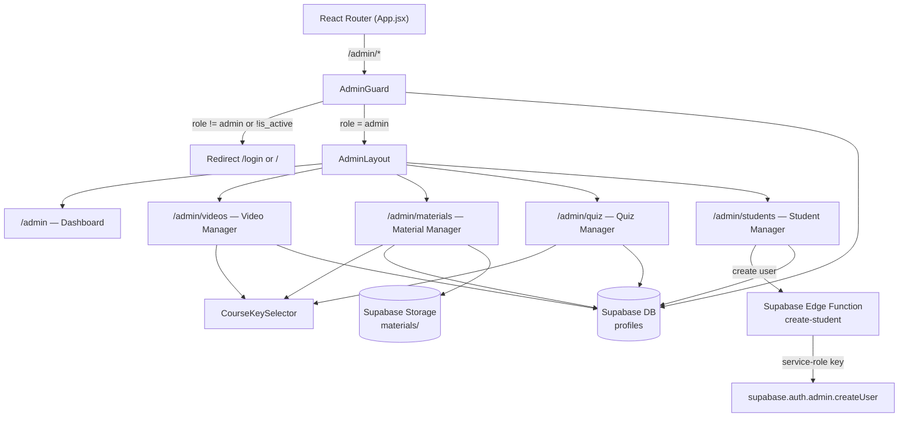

# Design Document — Admin Panel

## Overview

The Admin Panel adds a protected `/admin` section to the EduLearn platform. It is a parallel shell to the existing student `Layout`, sharing the same design tokens from `index.css` but visually distinct (darker sidebar accent, "Admin" badge). Admins can manage all course content (videos, materials, quiz questions) and student accounts without touching raw SQL.

Key architectural decisions:
- **AdminGuard** wraps all `/admin` routes and enforces `role = 'admin'` + `is_active = true` via a Supabase profile lookup.
- **AdminLayout** is a standalone shell component (not nested inside the student `Layout`) with its own sidebar.
- **Student creation** uses a Supabase Edge Function (`create-student`) invoked with the service-role key, since the SPA has no backend server.
- **Deactivation** uses `is_active boolean` on `profiles` rather than a role value, keeping `role` clean for access-control logic.
- **CourseKeySelector** is a reusable three-level dropdown (course → subclass → level) shared across all content management pages.

---

## Architecture



### Route Structure

```
/admin                    → AdminDashboard
/admin/videos             → AdminVideos
/admin/materials          → AdminMaterials
/admin/quiz               → AdminQuiz
/admin/students           → AdminStudents
```

All `/admin` routes are wrapped in `AdminGuard`, which renders `AdminLayout` as the outlet shell.

---

## Components and Interfaces

### AdminGuard

Route-level protection component. Fetches the current user's profile row and enforces `role = 'admin'` and `is_active = true`.

```jsx
// src/components/admin/AdminGuard.jsx
export default function AdminGuard({ children })
```

Behavior:
1. While `loading` (auth session or profile fetch pending) → render a centered loading spinner.
2. If no authenticated user → `<Navigate to="/login" replace />`.
3. If `profile.role !== 'admin'` or `profile.is_active === false` → `<Navigate to="/" replace />`.
4. Otherwise → render `children`.

Profile fetch: `supabase.from('profiles').select('role, is_active').eq('id', user.id).single()`

### AdminLayout

Shell component providing the admin sidebar and `<Outlet />` for nested routes.

```jsx
// src/components/admin/AdminLayout.jsx
export default function AdminLayout()
```

Sidebar nav items (in order):
| Label | Route | Icon |
|---|---|---|
| Dashboard | `/admin` | grid icon |
| Videos | `/admin/videos` | play icon |
| Materials | `/admin/materials` | document icon |
| Quiz Questions | `/admin/quiz` | question icon |
| Students | `/admin/students` | users icon |

Footer: admin display name, "Admin" role badge, sign-out button.

Mobile: hamburger button toggles sidebar overlay (same pattern as student `Layout`).

Visual distinction from student layout: sidebar uses `--color-accent` (`#2563eb`) as background tint with white text for active items, plus an "ADMIN" section label at the top.

### CourseKeySelector

Reusable controlled component for selecting a `course_key` via three cascading dropdowns.

```jsx
// src/components/admin/CourseKeySelector.jsx
// Props:
//   value: string | null  — current course_key (e.g. 'english_ielts_band5')
//   onChange: (courseKey: string) => void
export default function CourseKeySelector({ value, onChange })
```

Derives its options from `COURSE_CONFIG` (existing `courseConfig.js`). When all three levels are selected, calls `onChange(buildCourseKey(course, subclass, level))`.

### Admin Pages

Each page follows the same pattern: CourseKeySelector at the top to filter, a list of records below, and an inline form (or modal) for add/edit.

```
src/pages/admin/
  AdminDashboard.jsx   — stat cards (videos, materials, questions, students)
  AdminVideos.jsx      — video CRUD
  AdminMaterials.jsx   — material CRUD + file upload
  AdminQuiz.jsx        — quiz question CRUD
  AdminStudents.jsx    — student list + create + deactivate/reactivate
```

### AuthContext changes

`AuthContext` must be extended to:
1. Fetch `is_active` from `profiles` after sign-in.
2. On `onAuthStateChange`, re-fetch the profile and call `signOut()` if `is_active === false`.

```jsx
// Addition to AuthContext.jsx
const [profile, setProfile] = useState(null)

// After session is established, fetch profile
async function fetchProfile(userId) {
  const { data } = await supabase
    .from('profiles')
    .select('role, is_active')
    .eq('id', userId)
    .single()
  if (data?.is_active === false) {
    await supabase.auth.signOut()
    return
  }
  setProfile(data)
}
```

Expose `profile` from context so `AdminGuard` can read `role` without a second fetch.

### Supabase Edge Function — `create-student`

```
supabase/functions/create-student/index.ts
```

Invoked via `supabase.functions.invoke('create-student', { body: { email, password, fullName } })`.

```typescript
// Pseudocode
const adminClient = createClient(SUPABASE_URL, SERVICE_ROLE_KEY)
const { data, error } = await adminClient.auth.admin.createUser({
  email,
  password,
  user_metadata: { full_name: fullName },
  email_confirm: true,   // skip confirmation email
})
```

The function must:
- Validate that `email` and `password` are present.
- Return `{ userId }` on success or `{ error: message }` on failure.
- Be protected: only callable by authenticated admin users (check JWT role claim or re-verify via service role).

---

## Data Models

### Schema Changes

#### `profiles` table — add `is_active`

```sql
ALTER TABLE public.profiles
  ADD COLUMN IF NOT EXISTS is_active boolean NOT NULL DEFAULT true;
```

The `handle_new_user` trigger already inserts a profile row; `is_active` defaults to `true` so new users are active by default.

#### Updated `profiles` shape

```typescript
interface Profile {
  id: string           // uuid, FK to auth.users
  full_name: string | null
  role: 'student' | 'admin'
  is_active: boolean   // NEW — false = deactivated
  created_at: string
}
```

### Existing tables (no schema changes)

```typescript
interface Video {
  id: string
  course_key: string   // e.g. 'english_ielts_band5'
  title: string
  embed_url: string    // must start with 'https://www.youtube.com/embed/'
  duration_label: string | null
  difficulty: string
  sort_order: number
  created_at: string
}

interface Material {
  id: string
  course_key: string
  title: string
  file_url: string     // Supabase Storage public URL
  file_size_label: string | null
  sort_order: number
  created_at: string
}

interface QuizQuestion {
  id: string
  course_key: string
  question: string
  options: string[]    // exactly 4 elements
  correct_answer_index: number  // 0–3
  explanation: string | null
  sort_order: number
  created_at: string
}
```

### RLS Policy Changes

```sql
-- Allow admins to write to videos
CREATE POLICY "Admin write videos" ON public.videos
  FOR ALL
  USING (
    EXISTS (
      SELECT 1 FROM public.profiles
      WHERE id = auth.uid() AND role = 'admin'
    )
  );

-- Allow admins to write to materials
CREATE POLICY "Admin write materials" ON public.materials
  FOR ALL
  USING (
    EXISTS (
      SELECT 1 FROM public.profiles
      WHERE id = auth.uid() AND role = 'admin'
    )
  );

-- Allow admins to write to quiz_questions
CREATE POLICY "Admin write quiz_questions" ON public.quiz_questions
  FOR ALL
  USING (
    EXISTS (
      SELECT 1 FROM public.profiles
      WHERE id = auth.uid() AND role = 'admin'
    )
  );

-- Allow admins to update any profile row (for deactivation)
CREATE POLICY "Admin update profiles" ON public.profiles
  FOR UPDATE
  USING (
    EXISTS (
      SELECT 1 FROM public.profiles
      WHERE id = auth.uid() AND role = 'admin'
    )
  );
```

Note: The existing `"Own profile"` policy uses `FOR ALL`, which covers the student's own row. The new `"Admin update profiles"` policy covers admin writes to other rows. Supabase evaluates policies with OR logic, so both can coexist.

---

## Correctness Properties

*A property is a characteristic or behavior that should hold true across all valid executions of a system — essentially, a formal statement about what the system should do. Properties serve as the bridge between human-readable specifications and machine-verifiable correctness guarantees.*

### Property 1: YouTube URL validation rejects all non-embed URLs

*For any* string that does not begin with `https://www.youtube.com/embed/`, the URL validator function SHALL return an invalid result and the add/edit video form SHALL not submit.

**Validates: Requirements 4.4**

### Property 2: Edit form population preserves record data

*For any* content record (video or quiz question) with arbitrary field values, opening the edit form for that record SHALL populate every form field with the exact value from the record — no field is lost, truncated, or transformed.

**Validates: Requirements 4.5, 6.5**

### Property 3: File MIME type validation rejects non-PDF files

*For any* file whose MIME type is not `application/pdf`, the file validator SHALL return an invalid result and the upload SHALL not proceed.

**Validates: Requirements 5.3**

### Property 4: File size validation rejects oversized files

*For any* file whose size in bytes exceeds `20 * 1024 * 1024` (20 MB), the file validator SHALL return an invalid result and the upload SHALL not proceed.

**Validates: Requirements 5.4**

### Property 5: Quiz question form validation rejects incomplete questions

*For any* question form submission where the question text is empty or the number of non-empty options is fewer than four, the validator SHALL return an invalid result and the form SHALL not submit.

**Validates: Requirements 6.3**

### Property 6: Answer index validation rejects out-of-range values

*For any* integer value that is not in the set {0, 1, 2, 3}, the answer index validator SHALL return an invalid result.

**Validates: Requirements 6.4**

### Property 7: Student search filter correctness

*For any* list of student profiles and any non-empty search query string, every profile displayed after filtering SHALL have either `full_name` or `email` containing the query string (case-insensitive), and no matching profile SHALL be omitted from the results.

**Validates: Requirements 7.2**

### Property 8: Error messages surface Supabase error text

*For any* failed Supabase operation that returns an error object with a `message` field, the error text displayed to the admin SHALL contain that message string — no error is silently swallowed.

**Validates: Requirements 4.8, 5.7, 6.8, 7.7**

---

## Error Handling

| Scenario | Handling |
|---|---|
| Profile fetch fails in AdminGuard | Redirect to `/login` (fail-safe) |
| Supabase insert/update/delete fails | Show inline error banner with `error.message`; do not close the form |
| Edge Function `create-student` returns error | Show error message in the Create Student form |
| File upload fails mid-stream | Show error; do not insert the `materials` row |
| Material delete: Storage delete succeeds but DB delete fails | Show error; the orphaned file is acceptable (admin can retry) |
| Material delete: DB delete succeeds but Storage delete fails | Show warning; record is removed from UI but file remains in Storage |
| `is_active = false` detected on auth state change | `signOut()` immediately, redirect to `/login` |

All error states use the existing `--color-danger` / `--color-danger-bg` tokens from `index.css`.

---

## Testing Strategy

### Unit Tests (Vitest + React Testing Library)

Focus on specific examples, edge cases, and the pure validation logic:

- `AdminGuard` redirects for unauthenticated, student-role, and deactivated users
- `AdminGuard` renders children for admin users
- `AdminLayout` renders all 5 nav links
- `AdminDashboard` displays all 4 stat counts from mocked Supabase responses
- `CourseKeySelector` cascades correctly (selecting course resets subclass and level)
- `create-student` Edge Function returns correct shape on success and error

### Property-Based Tests (fast-check)

Use [fast-check](https://github.com/dubzzz/fast-check) for the 8 correctness properties above. Each test runs a minimum of 100 iterations.

Tag format: `// Feature: admin-panel, Property N: <property text>`

**P1 — URL validation:**
```
fc.property(fc.string(), url =>
  !url.startsWith('https://www.youtube.com/embed/') =>
    validateEmbedUrl(url).valid === false
)
```

**P2 — Edit form population:**
```
fc.property(arbitraryVideoRecord(), record => {
  render(<VideoEditForm initialData={record} />)
  // assert each field value matches record
})
```

**P3 — MIME type validation:**
```
fc.property(fc.string().filter(m => m !== 'application/pdf'), mime =>
  validateFile({ type: mime, size: 1024 }).valid === false
)
```

**P4 — File size validation:**
```
fc.property(fc.integer({ min: 20 * 1024 * 1024 + 1 }), size =>
  validateFile({ type: 'application/pdf', size }).valid === false
)
```

**P5 — Quiz question validation:**
```
fc.property(arbitraryIncompleteQuestion(), q =>
  validateQuestion(q).valid === false
)
```

**P6 — Answer index validation:**
```
fc.property(fc.integer().filter(n => n < 0 || n > 3), idx =>
  validateAnswerIndex(idx).valid === false
)
```

**P7 — Search filter:**
```
fc.property(fc.array(arbitraryStudent()), fc.string({ minLength: 1 }), (students, query) => {
  const results = filterStudents(students, query)
  return results.every(s =>
    s.full_name?.toLowerCase().includes(query.toLowerCase()) ||
    s.email?.toLowerCase().includes(query.toLowerCase())
  )
})
```

**P8 — Error message display:**
```
fc.property(fc.string({ minLength: 1 }), message => {
  const error = { message }
  render(<ErrorBanner error={error} />)
  expect(screen.getByText(message)).toBeInTheDocument()
})
```

### Integration Tests

- RLS policies: verify student-role JWT cannot write to `videos`, `materials`, `quiz_questions`, or update another user's `profiles` row (1–2 examples each, run against a local Supabase instance).
- Edge Function `create-student`: verify it creates a user in `auth.users` and the trigger creates a `profiles` row (1 example, local Supabase).
