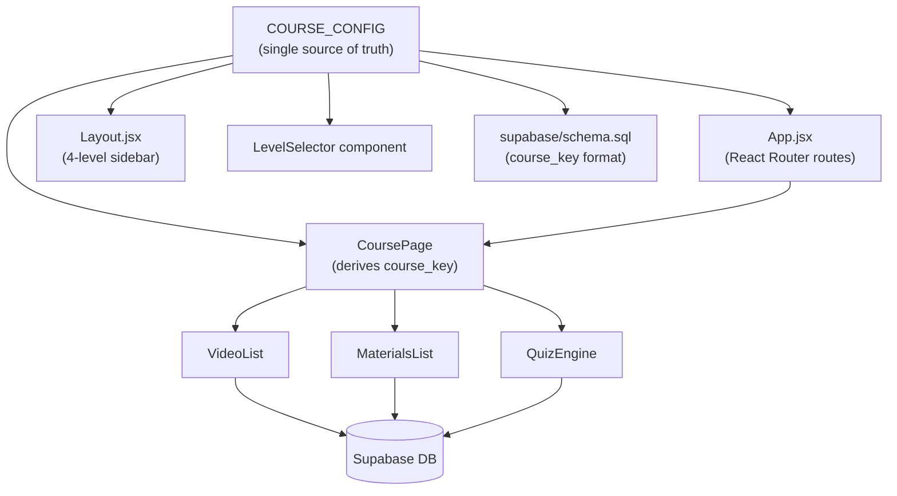

# Design Document — Course Structure Overhaul

## Overview

This overhaul introduces a 4-level navigation hierarchy (Course → Subclass → Level → Content Tab) across the entire platform. The key change is that Mandarin and Computer gain proper subclasses (previously they had none), and every subclass now exposes a set of named levels before content is shown.

A single `COURSE_CONFIG` object becomes the authoritative source of truth for subclasses, levels, default paths, and URL-key mappings. Every other layer — routing, sidebar, level selector, database keys — derives from this config rather than maintaining its own hardcoded lists.

The URL pattern changes from:
- English: `/{course}/{subclass}/{tab}` (3 levels)
- Mandarin/Computer: `/{course}/{tab}` (2 levels)

To a uniform 4-level pattern for all courses:
- `/{course}/{subclass}/{level}/{tab}`

The `course_key` used for database lookups changes from `english_GET` / `mandarin` / `computer` to the 3-segment format `{course}_{subclass}_{level}` (e.g. `english_GET_beginner`, `mandarin_HSK_hsk3`, `computer_web_intermediate`).

---

## Architecture



The data flow for a page render:

1. User navigates to `/{course}/{subclass}/{level}/{tab}`
2. React Router matches the route and passes `course`, `subclass`, `level`, `tab` as URL params
3. `CoursePage` builds `course_key = buildCourseKey(course, subclass, level)`
4. The active tab component queries Supabase with `WHERE course_key = ?`

---

## Components and Interfaces

### COURSE_CONFIG

A module-level constant exported from `src/lib/courseConfig.js`. All other components import from here.

```js
// src/lib/courseConfig.js

export const COURSE_CONFIG = {
  english: {
    label: 'English',
    icon: 'A',
    defaultSubclass: 'GET',
    subclasses: {
      GET: {
        label: 'GET',
        defaultLevel: 'beginner',
        levels: [
          { key: 'beginner',           label: 'Beginner' },
          { key: 'elementary',         label: 'Elementary' },
          { key: 'pre_intermediate',   label: 'Pre-Intermediate' },
          { key: 'intermediate',       label: 'Intermediate' },
          { key: 'upper_intermediate', label: 'Upper-Intermediate' },
          { key: 'advanced',           label: 'Advanced' },
        ],
      },
      IELTS: {
        label: 'IELTS',
        defaultLevel: 'band4',
        levels: [
          { key: 'band4',   label: 'Band 4' },
          { key: 'band5',   label: 'Band 5' },
          { key: 'band6',   label: 'Band 6' },
          { key: 'band7',   label: 'Band 7' },
          { key: 'band75',  label: 'Band 7.5+' },
        ],
      },
      PTE: {
        label: 'PTE',
        defaultLevel: 'pte_core',
        levels: [
          { key: 'pte_core',        label: 'PTE Core' },
          { key: 'pte_academic_50', label: 'PTE Academic (50)' },
          { key: 'pte_academic_65', label: 'PTE Academic (65)' },
          { key: 'pte_academic_79', label: 'PTE Academic (79+)' },
        ],
      },
    },
  },
  mandarin: {
    label: 'Mandarin',
    icon: '文',
    defaultSubclass: 'GM',
    subclasses: {
      GM: {
        label: 'GM',
        defaultLevel: 'hsk1',
        levels: [
          { key: 'hsk1', label: 'HSK 1' },
          { key: 'hsk2', label: 'HSK 2' },
          { key: 'hsk3', label: 'HSK 3' },
          { key: 'hsk4', label: 'HSK 4' },
          { key: 'hsk5', label: 'HSK 5' },
          { key: 'hsk6', label: 'HSK 6' },
        ],
      },
      HSK: {
        label: 'HSK',
        defaultLevel: 'hsk1',
        levels: [
          { key: 'hsk1', label: 'HSK 1' },
          { key: 'hsk2', label: 'HSK 2' },
          { key: 'hsk3', label: 'HSK 3' },
          { key: 'hsk4', label: 'HSK 4' },
          { key: 'hsk5', label: 'HSK 5' },
          { key: 'hsk6', label: 'HSK 6' },
        ],
      },
      TOCFL: {
        label: 'TOCFL',
        defaultLevel: 'band_a',
        levels: [
          { key: 'band_a', label: 'Band A' },
          { key: 'band_b', label: 'Band B' },
          { key: 'band_c', label: 'Band C' },
        ],
      },
    },
  },
  computer: {
    label: 'Computer',
    icon: '⌨',
    defaultSubclass: 'IOT',
    subclasses: {
      IOT:        { label: 'IOT',       defaultLevel: 'beginner', levels: computerLevels() },
      '3D_Design':{ label: '3D Design', defaultLevel: 'beginner', levels: computerLevels() },
      Web:        { label: 'Web',       defaultLevel: 'beginner', levels: computerLevels() },
      Desktop:    { label: 'Desktop',   defaultLevel: 'beginner', levels: computerLevels() },
      Mobile:     { label: 'Mobile',    defaultLevel: 'beginner', levels: computerLevels() },
      Database:   { label: 'Database',  defaultLevel: 'beginner', levels: computerLevels() },
    },
  },
}

function computerLevels() {
  return [
    { key: 'beginner',     label: 'Beginner' },
    { key: 'intermediate', label: 'Intermediate' },
    { key: 'advanced',     label: 'Advanced' },
  ]
}

/** Builds the database course_key from 3 URL params */
export function buildCourseKey(course, subclass, level) {
  return `${course}_${subclass}_${level}`.toLowerCase()
}

/** Returns the default path for a course */
export function defaultPath(course) {
  const c = COURSE_CONFIG[course]
  const sub = c.defaultSubclass
  const lvl = c.subclasses[sub].defaultLevel
  return `/${course}/${sub}/${lvl}/videos`
}

/** Returns the default path for a subclass */
export function defaultSubclassPath(course, subclass) {
  const lvl = COURSE_CONFIG[course].subclasses[subclass].defaultLevel
  return `/${course}/${subclass}/${lvl}/videos`
}
```

### App.jsx — Updated Routes

```jsx
// Uniform 4-level route for all courses
<Route path=":course" element={<CourseShell />}>
  <Route path=":subclass/:level/:tab" element={<CoursePage />} />
</Route>
```

Redirect rules are handled inside `CourseShell` (or via dedicated `<Route>` entries with `<Navigate>`).

### CourseShell (replaces per-course index files)

A single generic shell component that replaces `English/index.jsx`, `Mandarin/index.jsx`, and `Computer/index.jsx`. It reads `course` from URL params, looks up `COURSE_CONFIG[course]`, renders the `PageHeader`, subclass pills, `LevelSelector`, and `<Outlet>`.

```
Props: none (reads :course from URL params)
Renders: PageHeader, SubclassPills, LevelSelector, Tabs, Outlet
```

### LevelSelector (new component)

```
src/components/LevelSelector.jsx

Props:
  levels: Array<{ key: string, label: string }>
  activeLevel: string
  basePath: string   // e.g. /english/GET

Renders: pill buttons for each level, navigates to {basePath}/{level.key}/videos on click
```

### CoursePage — Updated

```
Props: none (reads all params from URL)
URL params consumed: course, subclass, level, tab
Derives: courseKey = buildCourseKey(course, subclass, level)
Renders: VideoList | MaterialsList | QuizEngine with courseKey prop
```

### Layout.jsx — Updated Sidebar

The sidebar now renders a 4-level tree driven by `COURSE_CONFIG`:

```
Level 1: Course (navItem)
  Level 2: Subclass (subItem) — shown when course is expanded
    Level 3: Level (subSubItem) — shown when subclass is active
      Level 4: Tab links (tabItem) — shown when level is active
```

A new CSS class `.tabItem` is added to `Layout.module.css` with `padding-left: 62px`.

---

## Data Models

### course_key Format

```
{course}_{subclass}_{level}

All lowercase. Spaces in subclass/level names replaced with underscores.

Examples:
  english_GET_beginner
  english_IELTS_band5
  english_PTE_pte_academic_65
  mandarin_GM_hsk1
  mandarin_HSK_hsk3
  mandarin_TOCFL_band_a
  computer_web_beginner
  computer_IOT_intermediate
  computer_3D_Design_advanced  →  computer_3d_design_advanced
```

### Updated supabase/schema.sql

The schema retains the same table structure. The only changes are:
1. Comments updated to reflect new `course_key` format examples
2. Old sample data rows removed and replaced with new rows using 3-segment keys
3. `progress` table comment updated (no structural change needed — `course_key text` already supports any string)

Key sample data rows required by Requirement 5.4:

| course_key                  | Content types |
|-----------------------------|---------------|
| english_GET_beginner        | video, material, quiz |
| english_IELTS_band5         | video, material, quiz |
| english_PTE_pte_academic_65 | video, material, quiz |
| mandarin_GM_hsk1            | video, material, quiz |
| mandarin_HSK_hsk1           | video, material, quiz |
| mandarin_TOCFL_band_a       | video, material, quiz |
| computer_web_beginner       | video, material, quiz |
| computer_IOT_beginner       | video, material, quiz |

### Redirect Map (Backward Compatibility)

| Old URL pattern                    | Redirects to                              |
|------------------------------------|-------------------------------------------|
| `/mandarin/:tab`                   | `/mandarin/GM/hsk1/:tab`                  |
| `/computer/:tab`                   | `/computer/IOT/beginner/:tab`             |
| `/english/GET/:tab` (no level)     | `/english/GET/beginner/:tab`              |
| `/english/IELTS/:tab` (no level)   | `/english/IELTS/band4/:tab`               |
| `/english/PTE/:tab` (no level)     | `/english/PTE/pte_core/:tab`              |
| `/english` (bare)                  | `/english/GET/beginner/videos`            |
| `/mandarin` (bare)                 | `/mandarin/GM/hsk1/videos`                |
| `/computer` (bare)                 | `/computer/IOT/beginner/videos`           |

---

## Correctness Properties

*A property is a characteristic or behavior that should hold true across all valid executions of a system — essentially, a formal statement about what the system should do. Properties serve as the bridge between human-readable specifications and machine-verifiable correctness guarantees.*

### Property 1: course_key format invariant

*For any* (course, subclass, level) triple drawn from COURSE_CONFIG, `buildCourseKey(course, subclass, level)` shall produce a string that is all-lowercase, contains no spaces, and consists of exactly three underscore-separated segments matching the input values.

**Validates: Requirements 5.2, 6.1**

### Property 2: LevelSelector renders config-defined levels

*For any* subclass entry in COURSE_CONFIG, rendering `LevelSelector` with that subclass's levels array shall display exactly those levels — no more, no fewer — in the same order as defined in the config.

**Validates: Requirements 2.1, 2.2, 2.3, 2.4, 2.5, 2.6, 2.7**

### Property 3: CoursePage passes correct course_key to child

*For any* valid (course, subclass, level, tab) tuple from COURSE_CONFIG, rendering `CoursePage` at the corresponding URL shall pass `buildCourseKey(course, subclass, level)` as the `courseKey` prop to the active tab component (VideoList, MaterialsList, or QuizEngine).

**Validates: Requirements 6.1, 6.2**

### Property 4: Valid navigation paths render without redirect

*For any* valid (course, subclass, level, tab) tuple from COURSE_CONFIG, navigating directly to `/{course}/{subclass}/{level}/{tab}` shall render the correct content tab component without triggering any redirect.

**Validates: Requirements 3.1, 3.2**

### Property 5: Missing level/tab triggers redirect to default

*For any* subclass in COURSE_CONFIG, navigating to `/{course}/{subclass}` (omitting level and tab) shall redirect to `/{course}/{subclass}/{defaultLevel}/videos` where `defaultLevel` is the subclass's `defaultLevel` from COURSE_CONFIG.

**Validates: Requirements 3.3**

### Property 6: Backward-compatible tab redirects preserve tab segment

*For any* tab value in `[videos, materials, quiz]`, navigating to an old-format URL (2-level or 3-level without a level segment) shall redirect to the equivalent new 4-level URL with the same tab value preserved.

**Validates: Requirements 8.1, 8.2, 8.3**

---

## Error Handling

- **Unknown course in URL**: The catch-all `<Route path="*">` in `App.jsx` redirects to `/`. No change needed.
- **Unknown subclass in URL**: `CourseShell` checks `COURSE_CONFIG[course]?.subclasses[subclass]`. If not found, redirects to `defaultPath(course)`.
- **Unknown level in URL**: `CourseShell` checks the levels array for the active subclass. If not found, redirects to `defaultSubclassPath(course, subclass)`.
- **Unknown tab in URL**: `CoursePage` renders nothing if `tab` is not one of `videos | materials | quiz`. The Tabs component will show no active tab.
- **Supabase returns empty array**: `VideoList`, `MaterialsList`, and `QuizEngine` already handle empty state — no change needed.
- **COURSE_CONFIG lookup failure**: `buildCourseKey` is a pure string concatenation and cannot fail. Guard checks in `CourseShell` prevent invalid keys from reaching Supabase.

---

## Testing Strategy

### Unit / Example Tests

- `buildCourseKey` with known inputs produces expected strings (3 examples per course)
- Default redirect for each course bare URL (`/english`, `/mandarin`, `/computer`)
- Default redirect for each subclass bare URL
- `CoursePage` renders `VideoList` for `tab=videos`, `MaterialsList` for `tab=materials`, `QuizEngine` for `tab=quiz`
- `CoursePage` renders nothing when no level is present
- Home page card descriptions match requirements
- Home page card click navigates to correct 4-level path

### Property-Based Tests

Using **fast-check** (TypeScript/JavaScript PBT library). Each property test runs a minimum of 100 iterations.

**Property 1 — course_key format invariant**
```
// Feature: course-structure-overhaul, Property 1: course_key format invariant
fc.assert(fc.property(
  fc.constantFrom(...allTuples),   // (course, subclass, level) from COURSE_CONFIG
  ([course, subclass, level]) => {
    const key = buildCourseKey(course, subclass, level)
    const parts = key.split('_')
    return (
      key === key.toLowerCase() &&
      !key.includes(' ') &&
      parts.length >= 3   // level keys may themselves contain underscores
    )
  }
))
```

**Property 2 — LevelSelector renders config-defined levels**
```
// Feature: course-structure-overhaul, Property 2: LevelSelector renders config-defined levels
fc.assert(fc.property(
  fc.constantFrom(...allSubclassEntries),
  ({ levels }) => {
    const { getAllByRole } = render(<LevelSelector levels={levels} activeLevel={levels[0].key} basePath="/" />)
    const buttons = getAllByRole('button')
    return buttons.length === levels.length &&
      levels.every((l, i) => buttons[i].textContent === l.label)
  }
))
```

**Property 3 — CoursePage passes correct course_key to child**
```
// Feature: course-structure-overhaul, Property 3: CoursePage passes correct course_key to child
fc.assert(fc.property(
  fc.constantFrom(...allValidTuples),
  ([course, subclass, level, tab]) => {
    const expectedKey = buildCourseKey(course, subclass, level)
    // render with MemoryRouter at the path, capture prop passed to mocked VideoList/MaterialsList/QuizEngine
    // assert received courseKey === expectedKey
  }
))
```

**Property 4 — Valid navigation paths render without redirect**
```
// Feature: course-structure-overhaul, Property 4: Valid navigation paths render without redirect
fc.assert(fc.property(
  fc.constantFrom(...allValidTuples),
  ([course, subclass, level, tab]) => {
    // render App with MemoryRouter initialEntries=[`/${course}/${subclass}/${level}/${tab}`]
    // assert location.pathname === `/${course}/${subclass}/${level}/${tab}` (no redirect)
  }
))
```

**Property 5 — Missing level/tab triggers redirect to default**
```
// Feature: course-structure-overhaul, Property 5: Missing level/tab triggers redirect to default
fc.assert(fc.property(
  fc.constantFrom(...allSubclassPaths),   // { course, subclass, defaultLevel }
  ({ course, subclass, defaultLevel }) => {
    // render App with MemoryRouter initialEntries=[`/${course}/${subclass}`]
    // assert final location === `/${course}/${subclass}/${defaultLevel}/videos`
  }
))
```

**Property 6 — Backward-compatible tab redirects preserve tab segment**
```
// Feature: course-structure-overhaul, Property 6: Backward-compatible tab redirects preserve tab segment
fc.assert(fc.property(
  fc.constantFrom('videos', 'materials', 'quiz'),
  (tab) => {
    // test /mandarin/${tab} → /mandarin/GM/hsk1/${tab}
    // test /computer/${tab} → /computer/IOT/beginner/${tab}
    // test /english/GET/${tab} → /english/GET/beginner/${tab}
    // assert tab segment is preserved in all redirects
  }
))
```

### Integration Tests

- Supabase query with a known `course_key` (e.g. `english_GET_beginner`) returns at least one row from `videos`, `materials`, and `quiz_questions` tables
- Schema smoke: `course_key` column exists in all three content tables and the `progress` table
