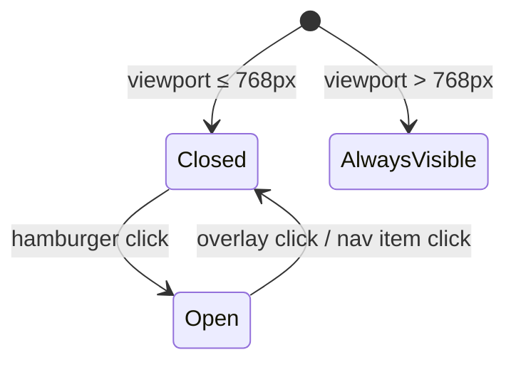

# Design Document: Site Revamp

## Overview

This document describes the technical design for the Erudite English platform UI/UX revamp. The goal is to modernise the visual design by introducing a centralised design token system, improving visual hierarchy, and polishing interactive states — without altering any existing routing, data-fetching, or authentication logic.

The revamp is purely a front-end styling and component-structure change. All changes are confined to `src/index.css`, `src/components/Layout.module.css`, and the inline `styles` objects within each page and component file.

### Key Design Decisions

- **CSS custom properties as the single source of truth.** All colours, radii, spacing, and typography values are defined once in `:root` and referenced everywhere. This satisfies the cascade requirement (1.5) by design.
- **Accent colour shift from near-black to a true blue.** The current `--color-accent: #1a1918` is indistinguishable from the text colour. The revamp introduces a distinct blue (`#2563eb`) that meets the 4.5:1 WCAG AA contrast requirement against white and clearly signals interactivity.
- **No new dependencies.** The existing `DM Sans` font (already loaded) is retained. No new libraries are introduced.
- **Responsive sidebar via CSS media query + React state.** A hamburger toggle is added to the main area header on narrow viewports; the sidebar slides in/out via a CSS class.

---

## Architecture

The application is a React SPA with React Router v6. The layout shell (`Layout.jsx`) renders the sidebar and a `<main>` outlet. All pages are rendered inside that outlet.

```
App
├── /login → LoginPage (unauthenticated, full-viewport card)
└── / → Layout (sidebar + main outlet)
    ├── index → Home
    ├── /english/:section/:tab → EnglishSection > CoursePage
    ├── /mandarin/:tab → MandarinSection > CoursePage
    └── /computer/:tab → ComputerSection > CoursePage
```

The revamp touches the following files:

| File | Change |
|---|---|
| `src/index.css` | Expand token set, add spacing/typography tokens, focus-visible rule |
| `src/components/Layout.module.css` | Accent-colour active states, responsive sidebar, micro-interaction transitions |
| `src/components/Layout.jsx` | Add mobile menu toggle button |
| `src/components/Tabs.jsx` | Active tab uses `--color-accent` border |
| `src/components/VideoList.jsx` | Active card border uses `--color-accent` |
| `src/components/QuizEngine.jsx` | Success/danger use token variables |
| `src/pages/Home.jsx` | Hover state on course cards |
| `src/pages/LoginPage.jsx` | Brand name corrected to "Erudite English" |
| `src/pages/CoursePage.jsx` | Add PageHeader with breadcrumb |
| `src/pages/English/index.jsx` | Pass header props |
| `src/pages/Mandarin/index.jsx` | Pass header props |
| `src/pages/Computer/index.jsx` | Pass header props |

---

## Components and Interfaces

### Design Token Layer (`src/index.css`)

All tokens are defined in `:root`. Components reference tokens only — never raw values.

**Colour tokens**

| Token | Value | Purpose |
|---|---|---|
| `--color-bg` | `#f5f4f1` | Page background |
| `--color-surface` | `#ffffff` | Card / panel surface |
| `--color-surface-2` | `#f0efe c` | Hover / subtle fill |
| `--color-border` | `rgba(0,0,0,0.08)` | Default border |
| `--color-border-strong` | `rgba(0,0,0,0.15)` | Input border |
| `--color-text` | `#1a1918` | Primary text |
| `--color-text-2` | `#5a5855` | Secondary text |
| `--color-text-3` | `#9a9895` | Muted / metadata text |
| `--color-accent` | `#2563eb` | Interactive accent |
| `--color-accent-hover` | `#1d4ed8` | Accent hover shade |
| `--color-accent-fg` | `#ffffff` | Text on accent bg |
| `--color-success` | `#166534` | Correct answer text |
| `--color-success-bg` | `#dcfce7` | Correct answer bg |
| `--color-danger` | `#991b1b` | Error / wrong answer text |
| `--color-danger-bg` | `#fee2e2` | Error / wrong answer bg |

**Typography tokens**

| Token | Value |
|---|---|
| `--font-size-sm` | `12px` |
| `--font-size-base` | `14px` |
| `--font-size-lg` | `16px` |
| `--line-height-body` | `1.6` |

**Spacing tokens**

| Token | Value |
|---|---|
| `--space-1` | `4px` |
| `--space-2` | `8px` |
| `--space-3` | `12px` |
| `--space-4` | `16px` |
| `--space-6` | `24px` |
| `--space-8` | `32px` |

**Border-radius tokens**

| Token | Value |
|---|---|
| `--radius-sm` | `6px` |
| `--radius-md` | `10px` |
| `--radius-lg` | `14px` |

---

### Sidebar (`Layout.jsx` + `Layout.module.css`)

The sidebar is a fixed-width (`230px`) flex column. On mobile (≤768px) it is hidden by default and toggled via a hamburger button rendered in the main area.

**Active state**: nav items and sub-items use `--color-accent` for the active indicator dot/border rather than the current near-black background.

**Footer**: Avatar circle uses `--color-accent` as background with white initials for stronger visual identity.

**Responsive behaviour**:
- A `.sidebarOpen` CSS class is toggled on the sidebar element via React state.
- On mobile the sidebar is `position: fixed`, `transform: translateX(-100%)` by default, and `translateX(0)` when open.
- A semi-transparent overlay behind the sidebar closes it on tap.



---

### Tab Bar (`Tabs.jsx`)

The active tab indicator changes from `--color-text` (near-black) to `--color-accent` (blue). No structural changes.

```
┌──────────┬────────────┬──────┐
│  Videos  │  Materials │ Quiz │
└──────────┴────────────┴──────┘
           ^^^^ accent border-bottom on active tab
```

---

### Home Page (`Home.jsx`)

Course cards gain an explicit `:hover` style via a `useState`-based hover flag (since inline styles don't support `:hover`). On hover: `box-shadow: 0 4px 16px rgba(0,0,0,0.10)` and `border-color: var(--color-border-strong)`.

Progress bars use `--color-accent` for the fill (already the case; this is preserved).

---

### Login Page (`LoginPage.jsx`)

- Brand name corrected from "EduLearn" to "Erudite English".
- Error box uses `--color-danger-bg` and `--color-danger` tokens (already the case; tokens are formalised).
- Button hover: `opacity: 0.88` on hover.
- Input focus: `border-color: var(--color-accent)` on `:focus`.

---

### Course Page (`CoursePage.jsx`)

A `PageHeader` is added above the `Tabs` component. The header receives:
- `title`: course + section name (e.g. "English — IELTS", "Mandarin", "Computer")
- `breadcrumb`: navigation path string (e.g. "Home / English / IELTS")

Each section page (`English/index.jsx`, `Mandarin/index.jsx`, `Computer/index.jsx`) is responsible for rendering the `PageHeader` and `Tabs` above the `<Outlet />`.

---

### Video List (`VideoList.jsx`)

Active card border changes from `--color-accent` (which was near-black) to the new blue `--color-accent`. No structural change needed — the token update handles this automatically.

---

### Quiz Engine (`QuizEngine.jsx`)

Correct/wrong answer styles are updated to use token variables instead of hardcoded hex values:

```js
correct: {
  border: '1px solid var(--color-success)',
  background: 'var(--color-success-bg)',
  color: 'var(--color-success)',
},
wrong: {
  border: '1px solid var(--color-danger)',
  background: 'var(--color-danger-bg)',
  color: 'var(--color-danger)',
},
```

---

### Focus Visible (`src/index.css`)

A global rule ensures all keyboard-focusable elements show an accent-coloured outline:

```css
:focus-visible {
  outline: 2px solid var(--color-accent);
  outline-offset: 2px;
}
```

---

## Data Models

No data model changes. The revamp is purely presentational. Existing Supabase tables (`videos`, `quiz_questions`, `quiz_attempts`) and their schemas are unchanged.

The only "data" relevant to the design layer is the shape of props passed to visual components:

```ts
// PageHeader
{ title: string; breadcrumb?: string }

// Tabs
{ basePath: string; tabs: Array<{ key: string; label: string }> }

// VideoList
{ courseKey: string }  // unchanged

// QuizEngine
{ courseKey: string }  // unchanged
```

---

## Correctness Properties

*A property is a characteristic or behavior that should hold true across all valid executions of a system — essentially, a formal statement about what the system should do. Properties serve as the bridge between human-readable specifications and machine-verifiable correctness guarantees.*

### Property 1: Greeting correctness

*For any* authenticated user name and any hour of the day (0–23), the greeting banner on the Home page should contain the user's name and the correct time-of-day salutation: "Good morning" for hours 0–11, "Good afternoon" for hours 12–16, and "Good evening" for hours 17–23.

**Validates: Requirements 5.1**

---

### Property 2: Course grid completeness

*For any* list of enrolled courses, the Home page course grid should render exactly one card per course, and each card should contain the course icon, title, description, a progress bar, and the completion percentage label.

**Validates: Requirements 5.2**

---

### Property 3: Progress bar proportionality

*For any* completion percentage value between 0 and 100 (inclusive), the progress bar fill element's CSS width should equal that percentage value (e.g. a 37% completion should produce `width: 37%`).

**Validates: Requirements 5.5, 9.2**

---

### Property 4: Tab bar completeness

*For any* course section rendered by the platform, the Tab Bar should display exactly three tabs with labels "Videos", "Materials", and "Quiz", in that order.

**Validates: Requirements 7.2**

---

### Property 5: Video card field completeness

*For any* video object containing a title, duration label, and difficulty label, the rendered video card should display all three fields plus a thumbnail placeholder element.

**Validates: Requirements 8.1**

---

### Property 6: Quiz progress indicator accuracy

*For any* current question index `i` (0-based) and total question count `n`, the quiz progress text should display "Question {i+1} of {n}".

**Validates: Requirements 9.1**

---

### Property 7: Answer option letter badges

*For any* question with between 1 and 4 answer options, each rendered option row should display the correct sequential letter badge (A for index 0, B for index 1, C for index 2, D for index 3) alongside the option text.

**Validates: Requirements 9.3**

---

### Property 8: Answer selection highlighting

*For any* question and *for any* selected answer index, after selection: the option at the correct answer index should have success styles applied, and if the selected index differs from the correct index, the selected option should have danger styles applied.

**Validates: Requirements 9.4**

---

## Error Handling

| Scenario | Handling |
|---|---|
| Sign-in failure | `LoginPage` catches the error and renders it in the `errorBox` container using `--color-danger-bg` / `--color-danger` tokens |
| No videos for a section | `VideoList` renders a muted placeholder paragraph |
| No quiz questions for a section | `QuizEngine` renders a muted placeholder paragraph |
| No materials for a section | `MaterialsList` renders a muted placeholder (existing behaviour, unchanged) |
| Auth loading state | `ProtectedRoute` renders a centred loading indicator before redirecting |
| Supabase fetch error | Currently unhandled at the UI level; out of scope for this revamp |

---

## Testing Strategy

### Unit Tests (Vitest + React Testing Library)

Unit tests cover specific rendering examples and edge cases. They should be kept lean — property tests handle broad input coverage.

**Design token smoke tests** (`src/index.css`):
- Verify all required `--color-*`, `--radius-*`, `--space-*`, and `--font-size-*` tokens are present in `:root`
- Verify `--color-bg` and `--color-surface` have different values
- Verify `--sidebar-width` is `230px`
- Verify `--color-accent` achieves ≥ 4.5:1 contrast ratio against `#ffffff`

**Component example tests**:
- `LoginPage`: renders brand name, heading, subtitle, email/password fields with labels; error box appears on failed auth; button is disabled during loading
- `Layout`: sidebar renders logo, subtitle, all three course nav items with icons and chevrons, footer with avatar/name/role/sign-out
- `Tabs`: active tab has `border-bottom` with accent colour; inactive tabs do not
- `VideoList`: clicking a card shows the player iframe; active card has accent border; empty state shows placeholder
- `QuizEngine`: results screen shows score, emoji, and try-again button; empty state shows placeholder
- `Home`: clicking a course card navigates to the correct path

### Property-Based Tests (fast-check)

Property tests use [fast-check](https://github.com/dubzzz/fast-check) and run a minimum of 100 iterations each. Each test is tagged with a comment referencing the design property it validates.

**Tag format:** `// Feature: site-revamp, Property {N}: {property_text}`

**P1 — Greeting correctness**
- Generator: arbitrary string (user name) × integer in [0, 23] (hour)
- Assertion: rendered banner contains the name and the correct salutation string

**P2 — Course grid completeness**
- Generator: array of 1–10 course objects with arbitrary icon, title, desc, progress
- Assertion: rendered grid has exactly `courses.length` cards; each card contains the course's title and progress value

**P3 — Progress bar proportionality**
- Generator: integer in [0, 100]
- Assertion: the fill element's `width` style equals `${value}%`
- Covers both `Home` course cards and `QuizEngine` progress bar

**P4 — Tab bar completeness**
- Generator: arbitrary `basePath` string
- Assertion: `Tabs` rendered with the standard 3-tab config always shows "Videos", "Materials", "Quiz" in order

**P5 — Video card field completeness**
- Generator: arbitrary video object `{ title: string, duration_label: string, difficulty: string }`
- Assertion: rendered card contains title text, duration text, difficulty text, and a thumbnail element

**P6 — Quiz progress indicator accuracy**
- Generator: integer `n` in [1, 20] (total questions) × integer `i` in [0, n-1] (current index)
- Assertion: progress text equals `Question ${i+1} of ${n}`

**P7 — Answer option letter badges**
- Generator: array of 1–4 arbitrary option strings
- Assertion: each rendered option row contains the correct letter badge at its index position

**P8 — Answer selection highlighting**
- Generator: question with 2–4 options × correct answer index × selected answer index
- Assertion: correct option always has success styles; if selected ≠ correct, selected option has danger styles

### Integration / Manual Tests

- Responsive sidebar: manually verify collapse/expand at 768px breakpoint
- Keyboard navigation: tab through all interactive elements and verify focus-visible outlines appear
- Contrast: use browser DevTools accessibility panel to verify accent colour contrast ratio
